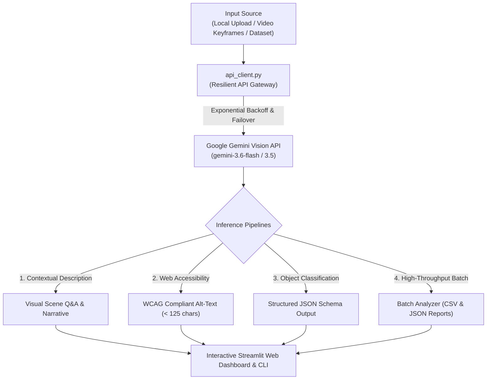

# Multimodal Vision & Batch Intelligence Platform

An end-to-end multimodal computer vision application and batch intelligence pipeline powered by Google Gemini Vision LLMs (`gemini-3.6-flash`). Automates visual content comprehension, WCAG-compliant web accessibility alt-text generation, structured JSON object extraction, and video temporal keyframe analysis across large-scale image repositories.

---

## 🏗️ Architecture & Workflow



---

## 🌟 Key Features & Components

1. **Core Image Handling & API Client** ([image_utils.py](image_utils.py), [api_client.py](api_client.py)):
   - Encodes local image files to Base64 or processes PIL Image objects.
   - Includes automatic exponential backoff retries and fallback models for high-demand API periods (`gemini-3.6-flash` → `gemini-3.5-flash` → `gemini-3.1-flash-lite`).
   - Securely loads credentials via `.env`.

2. **Specialized Multimodal Use Cases** ([use_cases.py](use_cases.py)):
   - **Use Case 1 (Image Description & Q&A)**: Comprehensive visual content breakdown or custom Q&A answers.
   - **Use Case 2 (Alt-Text Generation)**: WCAG-compliant HTML web accessibility descriptions under 125 characters.
   - **Use Case 3 (Object Recognition)**: Structured JSON output identifying object names, categories, colors, and locations.

3. **High-Throughput Batch Intelligence Analyzer** ([batch_analyzer.py](batch_analyzer.py)):
   - Automated analysis across *N* image assets in parallel.
   - Exports results to structured files: `batch_analysis_results.csv` and `batch_analysis_results.json`.

4. **Visual Web Browser Dashboard** ([web_app.py](web_app.py)):
   - Full-featured Streamlit dashboard featuring drag-and-drop uploads, dataset selection, filename search, interactive JSON inspector, and CSV export.

5. **Terminal CLI Application** ([app.py](app.py)):
   - Lightweight command-line interface for headless environments.

---

## 📖 Setup Instructions

### 1. Install Dependencies
```bash
pip install google-genai python-dotenv pillow streamlit pandas opencv-python
```

### 2. Configure Your API Key
Create a `.env` file in the project root directory and add your key:
```env
GEMINI_API_KEY=your_gemini_api_key_here
```

---

## 🌐 Visual Web Browser UI Guide (`web_app.py`)

### 1. How to Launch the Web App

#### Scenario A: Fresh Start (Server Not Running)
In your terminal, run:
```bash
python -m streamlit run web_app.py
```
*(This starts the local web server and automatically opens your browser to `http://localhost:8501`!)*

#### Scenario B: Server is Already Running
If the terminal is already running the server, simply open your browser (Chrome/Edge) and go to:
👉 **`http://localhost:8501`**

---

### 2. Using the Sidebar (Image Selection)

- **Instagram Dataset (911 Photos)**:
  - Use the number stepper to jump to any photo index (`1` to `911`).
  - Click **`🎲 Random`** to pick a random photo instantly.
  - Type in **`Search Filename`** (e.g. `629224241` or `450599840`) to find a specific photo.
- **Upload Custom Image**: Drag-and-drop any image file directly from your computer.
- **Synthetic Test Image**: Generates a test image with shapes and text for verification.

---

### 3. Using the 4 Interactive Analysis Tabs

- **Tab 1: 📝 Description & Q&A**  
  - Leave blank and click **🚀 Analyze Image** for a full visual breakdown.
  - OR type a custom question (e.g., *"What color is the pen?"*) for targeted answers.

- **Tab 2: 🏷️ Web Alt-Text**  
  - Click **✨ Generate Alt-Text** to get a WCAG-compliant description (under 125 characters) with ready-to-copy HTML code.

- **Tab 3: 🔍 Object Recognition**  
  - Click **🔍 Detect Objects** to view an interactive JSON tree containing object names, categories, and colors.

- **Tab 4: 📊 Batch Exporter**  
  - Select the slider for how many photos to analyze (e.g. `5`).
  - Click **⚡ Run Batch Export Job** to process the photos and click **`📥 Download CSV Report`** to open in Excel!

---

## 💻 Terminal CLI App Guide (`app.py`)

If you prefer running inside the terminal interface:

### 1. Launch Terminal App
```bash
python app.py
```
*(Pro-Tip: Click inside the terminal and press **Up Arrow `↑`** + **Enter** to re-run!)*

### 2. Menu Reference
- **Option 1**: Describe active photo or ask a custom question.
- **Option 2**: Generate HTML web `alt-text`.
- **Option 3**: Detect objects in structured JSON.
- **Option 4**: Select a random photo from the 911 collection.
- **Option 5**: Search photo by index (`1-911`) or filename (e.g. `629224241`).
- **Option 6**: Run batch export job to `batch_analysis_results.csv`.
- **Option 7**: Enter custom image file path (quotes are stripped automatically).
- **Option 8**: Exit.
